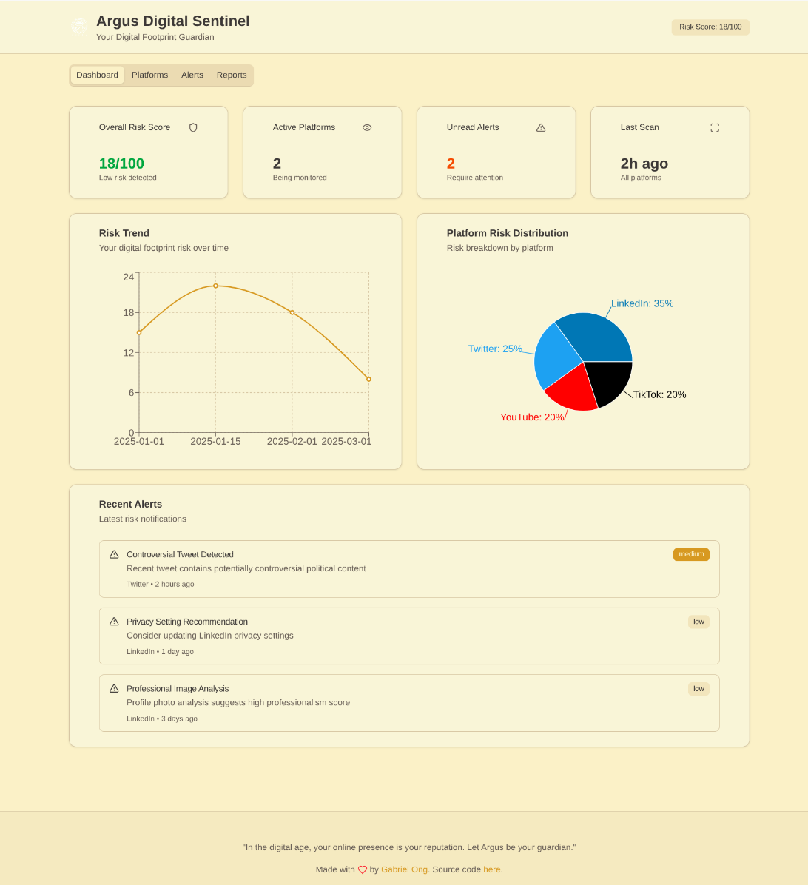
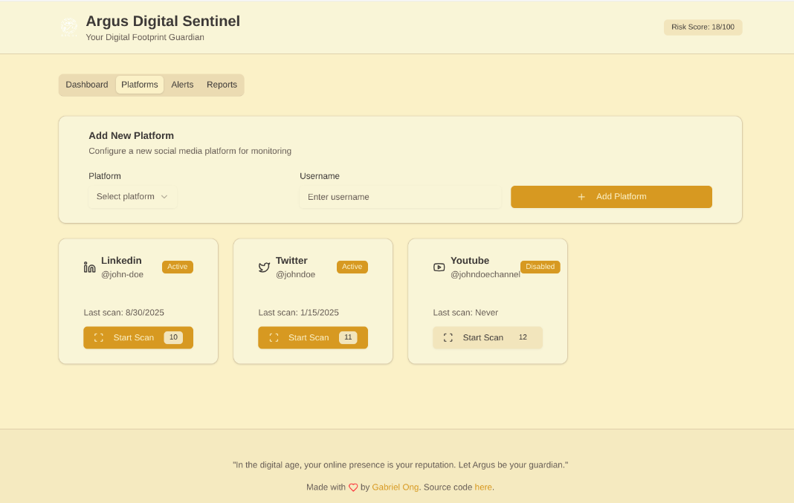
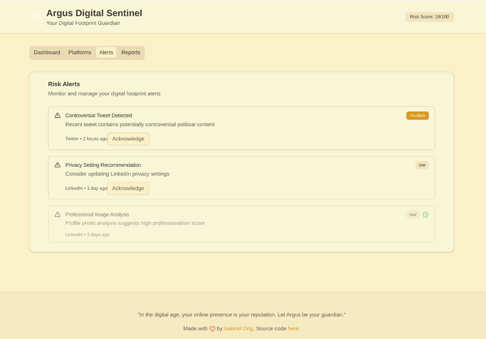
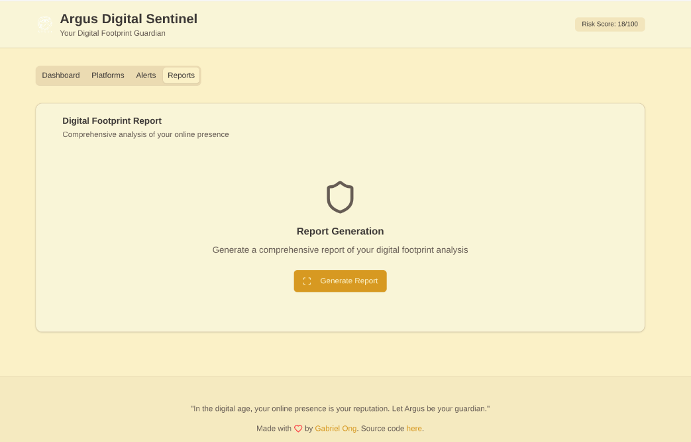
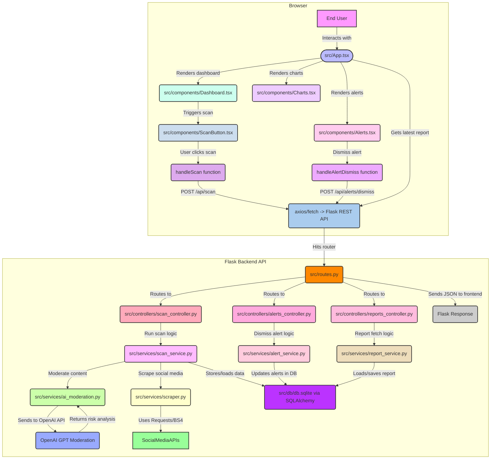

[](https://github.com/gongahkia/argus/releases/tag/1.0.0) 

# `Argus`

Full Stack Web App that monitors your [digital footprint](https://en.wikipedia.org/wiki/Digital_footprint) across [various social media platforms](#coverage) to prevent [career suicide](https://www.urbandictionary.com/define.php?term=career%20suicide) and professional self-sabotage.

Made mainly to practise this [stack](#stack). My takeaways can be found [here](#takeaways).

## Stack

* *Frontend*: [React](https://react.dev/), [Vite](https://vite.dev/), [TypeScript](https://www.typescriptlang.org/)
* *Backend*: [Flask](https://flask.palletsprojects.com/), [Python](https://www.python.org/), [SQLAlchemy](https://www.sqlalchemy.org/)
* *DB*: [SQLite](https://www.sqlite.org/)
* *AI*: [OpenAI GPT](https://openai.com/api/), [Content Analysis](https://platform.openai.com/docs/guides/moderation)
* *UI*: [shadcn/ui](https://ui.shadcn.com/), [Tailwind CSS](https://tailwindcss.com/), [Recharts](https://recharts.org/)
* *Scraping*: [BeautifulSoup](https://www.crummy.com/software/BeautifulSoup/), [Requests](https://requests.readthedocs.io/)
* *Deployment*: [Vite Static Build](https://vite.dev/guide/build.html)

## Screenshots

### Argus Dashboard



### Argus Platform



### Argus Alerts



### Argus Report Generation



## Usage

> [!IMPORTANT]
> Read the [legal disclaimer](#legal-disclaimer) before using `Argus`.

The below instructions are for locally hosting `Argus`.

1. Execute the below.

```console
$ git clone https://github.com/gongahkia/argus && cd argus
```

2. Create `.env` at the project root with the relevant secrets.

```env
OPENAI_API_KEY=XXX
OPENAI_API_BASE=https://api.openai.com/v1
FLASK_ENV=XXX
```

3. Then run the below to start up **development** and **production builds** of the [Frontend](./argus-frontend/) and [Backend](./src/).

```console
# Backend setup
$ python3 -m venv venv
$ source venv/bin/activate
$ pip install -r requirements.txt

# Frontend setup
$ cd argus-frontend
$ npm install
$ npm run build
$ cd ..

# Copy frontend to Flask static
$ cp -r argus-frontend/dist/* src/static/

# Start application
$ chmod +x start.sh
$ ./start.sh
```

## Coverage

`Argus` currently supports the following sites.

* [Facebook](https://www.facebook.com/)
* [Twitter (X)](https://x.com/)
* [LinkedIn](https://www.linkedin.com/feed/)
* [Instagram](https://www.instagram.com/)
* [YouTube](https://www.youtube.com/)

## Architecture



## Endpoints

| Endpoint Type         | Source                            | Schema                                                                                                         | Example command                                                                                                                              |
| :---                 | :---                              | :---                                                                                                          |:---                                                                                                                                         |
| User Authentication  | Local Argus Server                | `{"username": "<USERNAME>", "password": "<PASSWORD>"}`                                                        | `curl -X POST http://localhost:5000/api/auth/login -H "Content-Type: application/json" -d '{"username": "alice", "password": "xxx"}'`         |
| Profile Retrieval    | Local Argus Server                | JWT bearer in header                                                                                           | `curl -X GET http://localhost:5000/api/user/profile -H "Authorization: Bearer <TOKEN>"`                                                      |
| Add Social Media     | Facebook, X, LinkedIn, Instagram  | `{"platform": "<PLATFORM>", "account_id": "<USERID>"}`                                                        | `curl -X POST http://localhost:5000/api/channels/add -H "Content-Type: application/json" -d '{"platform": "twitter", "account_id": "bob456"}'`|
| Scan for Risks       | Argus content analysis pipeline    | JWT bearer in header                                                                                           | `curl -X POST http://localhost:5000/api/scan -H "Authorization: Bearer <TOKEN>"`                                                             |
| Get Latest Report    | Local Argus Server                | JWT bearer in header                                                                                           | `curl -X GET http://localhost:5000/api/report/latest -H "Authorization: Bearer <TOKEN>"`                                                     |
| Download Report      | Local Argus Server                | Format in query string (e.g. `?format=pdf`)                                                                    | `curl -X GET "http://localhost:5000/api/report/download?format=pdf" -H "Authorization: Bearer <TOKEN>"`                                      |
| Risk Assessment      | OpenAI Moderation API              | `{"content": "<POST_TEXT>"}`                                                                                   | `curl -X POST http://localhost:5000/api/content/assess -H "Content-Type: application/json" -d '{"content": "Check my post for risk"}'`        |
| Alerts Dismissal     | Local Argus Server                | `{"alert_id": "<ALERTID>"}`                                                                                    | `curl -X POST http://localhost:5000/api/alerts/dismiss -H "Content-Type: application/json" -d '{"alert_id": "12345"}'`                        |

## Takeaways

* Integrating OpenAI's content moderation API with custom risk assessment logic provided surprisingly nuanced analysis of social media content that goes beyond simple keyword filtering.
* Building a privacy-first architecture where all processing happens locally (except AI analysis) was crucial for user trust and data protection.
* Flask's simplicity allowed rapid prototyping of AI-powered endpoints while maintaining clear separation between data collection, analysis, and reporting concerns.

## Reference

The name `Argus` is in reference to [Argus Panoptes](https://en.wikipedia.org/wiki/Argus_Panoptes) *(Ἄργος Πανόπτης)*, the all-seeing giant from Greek mythology with eyes covering his entire body who acted as Zeus' protector. 


## Legal Disclaimer

### For Informational Purposes Only

The information provided by Argus is intended solely for general informational purposes regarding digital footprint monitoring and online reputation management. While every effort is made to ensure the accuracy and reliability of the analysis, Argus makes no guarantees, representations, or warranties of any kind, express or implied, about the completeness, accuracy, reliability, suitability, or availability of the risk assessments or recommendations presented. Users should independently verify any information before making decisions based on it.

### No Professional Advice

Argus does not provide professional legal, career, public relations, or cybersecurity advice, consultation, or representation. The risk assessments and recommendations obtained through Argus should not be considered a substitute for professional advice from qualified practitioners, legal counsel, or career consultants. Users are strongly encouraged to consult with appropriate professionals regarding their specific digital privacy and reputation management needs.

### No Endorsement

The inclusion of any social media platforms, content analysis results, risk assessments, or third-party integrations within Argus does not constitute an endorsement or recommendation of those platforms or their content policies. Argus is not affiliated with any social media platforms or external content providers unless explicitly stated.

### Third-Party Content and Platform Data

Argus aggregates and analyzes information sourced from various social media platforms and third-party APIs. Argus does not control, monitor, or guarantee the accuracy, completeness, or reliability of such third-party content or platform data. The analysis is based on publicly available information and AI-powered content assessment. Use of information obtained from these sources is at the user's own risk, and Argus disclaims all liability for any content, claims, or damages resulting from platform data collection or analysis.

### AI-Powered Analysis Limitations

Argus utilizes artificial intelligence and machine learning algorithms for content analysis and risk assessment. These AI systems may produce inaccurate, incomplete, or biased results. AI analysis should not be considered definitive or infallible. Users should exercise independent judgment when interpreting AI-generated risk scores, recommendations, or alerts. Argus disclaims all liability for decisions made based on AI analysis results.

### Use at Your Own Risk

Users access, use, and rely on Argus and its analysis results at their own risk. Social media content, platform policies, and professional standards may change rapidly without notice. Risk assessments may become outdated or inaccurate. Argus disclaims all liability for any loss, injury, damage, career impact, or reputational harm, direct or indirect, arising from reliance on the information, analysis, or recommendations provided. This includes but is not limited to missed career opportunities, employment decisions, professional relationships, or business impacts resulting from content displayed or analysis performed.

### Privacy and Data Collection

Argus processes social media content and personal information for analysis purposes. While efforts are made to protect user privacy through local processing, users acknowledge that:

* Social media content analysis requires accessing publicly available information
* OpenAI API integration involves sending content for analysis (subject to OpenAI's privacy policy)
* Local database storage contains scan results and user preferences
* Users are responsible for understanding the privacy implications of digital footprint monitoring

### Limitation of Liability

To the fullest extent permitted by law:

* Argus shall not be liable for any direct, indirect, incidental, consequential, or punitive damages arising out of your use of the application, reliance on any analysis results, or decisions made based on risk assessments.
* Argus disclaims all liability for errors, omissions, false positives, false negatives, or misinterpretations in AI-powered content analysis.
* Our total liability under any circumstances shall not exceed the amount paid by you (if any) for using Argus.
* Argus is not responsible for changes in social media platform policies, content removal, account suspensions, or professional consequences resulting from your online activity.

### User Responsibility

Users are solely responsible for:

* Verifying the accuracy and relevance of any risk assessments or recommendations obtained through Argus.
* Understanding their organization's social media policies and professional conduct requirements.
* Making informed decisions about their online presence and digital footprint management.
* Seeking appropriate professional advice for their specific career and reputation management circumstances.
* Complying with all applicable laws, regulations, platform terms of service, and professional conduct rules.
* Understanding that automated analysis is not a substitute for human judgment and professional guidance.
* Regularly reviewing and updating their privacy settings and online content independent of Argus recommendations.

### Platform Terms and Compliance

Users must ensure their use of Argus complies with the terms of service of all monitored social media platforms. Argus does not guarantee compliance with platform-specific data collection policies or terms of service. Users are responsible for understanding and adhering to platform guidelines regarding automated data collection and analysis.

### Copyright and Intellectual Property

Argus respects intellectual property rights and processes only publicly available social media content for analysis purposes. The application does not store or redistribute copyrighted content beyond what is necessary for risk assessment functionality. If you believe your copyrighted work has been inappropriately processed by Argus, please contact the creator to address your concerns.

### Changes to Analysis and Content

Argus reserves the right to modify, update, or discontinue any analysis features, risk assessment algorithms, or platform integrations at any time without prior notice. Social media monitoring capabilities, AI analysis models, and risk scoring methodologies may change without notice due to various factors including platform API changes, AI model updates, or service improvements.

### Jurisdiction

This disclaimer and your use of Argus shall be governed by and construed in accordance with the laws of Singapore. Any disputes arising out of or in connection with this disclaimer shall be subject to the exclusive jurisdiction of the courts in Singapore.